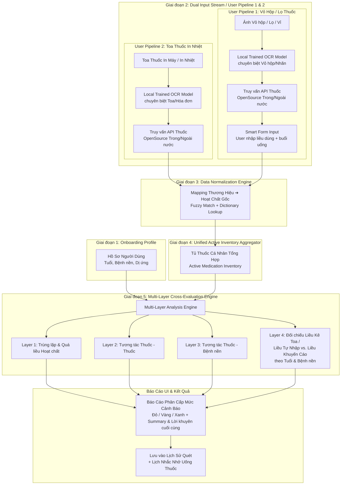

# Mediscan AI — Tài Liệu Kiến Trúc Hệ Thống (System Architecture)

Tài liệu này mô tả chi tiết kiến trúc hệ thống, luồng xử lý dữ liệu, thiết kế schemas và các nguyên tắc lập trình của dự án **Mediscan AI - Trợ Lý Cảnh Báo Tương Tác & An Toàn Thuốc**.

---

## 1. Tổng Quan Hệ Thống & Nguyên Tắc Thiết Kế (System Overview & Design Principles)

### 📌 Định Hướng Sản Phẩm
**Mediscan AI** cung cấp giải pháp tham khảo và cảnh báo sớm nguy cơ tương tác thuốc kỵ nhau, trùng lặp hoạt chất gây quá liều, hoặc xung đột giữa đơn thuốc với tiền sử bệnh lý của người dùng. Hệ thống được thiết kế theo mô hình **Centralized API-Driven Architecture** nhằm tối ưu hóa khả năng tái sử dụng logic phân tích trên nhiều nền tảng:
1. **Web Desktop Application (Next.js 14+):** Nền tảng cốt lõi giai đoạn đầu phục vụ upload đơn thuốc, quản lý tủ thuốc cá nhân và hiển thị báo cáo chi tiết.
2. **Mobile Application (Flutter / React Native):** Định hướng mở rộng ở giai đoạn tiếp theo để quét nhanh vỏ hộp thuốc tại hiệu thuốc.

> ⚠️ **Cập nhật kiến trúc (Architecture Pivot):** Kể từ Stage 2, hệ thống đã **loại bỏ hoàn toàn phụ thuộc vào VLM thương mại bên thứ ba** (Gemini Vision / GPT-4o Vision). Toàn bộ pipeline trích xuất (Pipeline 1 – Vỏ/lọ/hộp thuốc, Pipeline 2 – Toa thuốc in nhiệt) chạy bằng **model OCR tự huấn luyện/tự host on-premise** (nền tảng ban đầu: PP-OCRv6 ONNX Runtime, sẽ được huấn luyện lại chuyên biệt cho từng luồng sau khi hoàn thiện toàn bộ hệ thống). Mọi mô tả "VLM Full-page Parser" hoặc "VLM Focus API" trong các mục bên dưới cần được hiểu là **Local Trained OCR Model**, không gọi API ảnh ra bên ngoài.

### 📐 Nguyên Tắc Thiết Kế Cốt Lõi

```
┌──────────────────────────────────────────────────────────────────┐
│                    Human-in-the-Loop (HITL)                      │
│   AI trích xuất dữ liệu ──► Xác nhận & sửa đổi từ chuyên gia/user │
└────────────────────────────────┬─────────────────────────────────┘
                                 │
                                 ▼
┌──────────────────────────────────────────────────────────────────┐
│                   Graceful Degradation Fallback                  │
│   Trích xuất VLM thất bại ──► Chuyển sang Smart Form tự động     │
└────────────────────────────────┬─────────────────────────────────┘
                                 │
                                 ▼
┌──────────────────────────────────────────────────────────────────┐
│                      Privacy & Safety First                      │
│   Ảnh xử lý trong RAM ──► Phân cấp cảnh báo đỏ/vàng/xanh ──► Disclaimer│
└──────────────────────────────────────────────────────────────────┘
```

### 🖥️ Cấu Trúc 3 Trang UI/UX Chính

| Trang | Tên | Nội dung |
| :--- | :--- | :--- |
| **Trang 1** | Onboarding | Yêu cầu User cung cấp thông tin chi tiết: tuổi, bệnh nền, dị ứng (đầu vào cho `UserProfile`). |
| **Trang 2** | MediScan AI (Core) | Nơi thực hiện **User Pipeline 1** (upload vỏ/lọ/hộp thuốc) và **User Pipeline 2** (upload toa thuốc in nhiệt): Trích xuất → Tổng hợp → Đánh giá (4 Layer) → hiển thị báo cáo + Summary/lời khuyên cuối cùng. |
| **Trang 3** | Quản lý User | Quản lý Tủ thuốc (Active Cabinet), **Lịch sử** các lần quét (Medication History), và **Nhắc nhở uống thuốc** (Medication Reminders). |

1. **Human-in-the-Loop (HITL - Đặt con người làm trọng tâm):**
   * Do đặc thù y tế yêu cầu độ chính xác tuyệt đối, mọi kết quả trích xuất tự động từ AI (OCR/VLM) đều phải qua bước kiểm tra, xác nhận và cho phép chỉnh sửa bởi người dùng trước khi đưa vào phân tích y khoa.
2. **Graceful Degradation / Hybrid Fallback (Suy thoái có kiểm soát):**
   * Nếu chất lượng hình ảnh đơn thuốc/vỏ hộp kém dẫn đến độ tin cậy trích xuất (Confidence Score) thấp hoặc mô hình VLM gặp lỗi kết nối, hệ thống sẽ tự động chuyển sang chế độ **Smart Form** (Form nhập liệu thông minh tích hợp tìm kiếm gợi ý từ điển) để người dùng tự chọn nhanh biệt dược/hoạt chất.
3. **Privacy & Safety First (Bảo mật & An toàn thông tin):**
   * **Bảo mật (Zero Image Persistence & RAM-Only):** Dữ liệu hình ảnh y tế nhạy cảm chỉ được nạp và xử lý tạm thời trên RAM (In-memory buffer) của Server, tuyệt đối không lưu trữ xuống đĩa cứng, database, cache hay temporary file ở mọi Stage.
   * **An toàn:** Báo cáo tương tác thuốc được phân cấp rõ ràng theo các mức độ nghiêm trọng và luôn đi kèm điều khoản miễn trừ trách nhiệm y tế (Disclaimer).

---

## 2. Kiến Trúc Luồng Dữ Liệu Cốt Lõi (Core Data Pipeline)

Luồng dữ liệu của hệ thống trải qua 5 giai đoạn xử lý từ đầu vào thô cho tới báo cáo tương tác hoàn chỉnh:



> **Ghi chú luồng:** Sơ đồ trên hợp nhất **User Pipeline 1** (Vỏ/lọ/hộp thuốc — Branch B) và **User Pipeline 2** (Toa thuốc in nhiệt — Branch A) như đã định nghĩa ở phần đầu tài liệu. Layer 4 (mới) đảm nhiệm việc: (a) với toa thuốc — kiểm tra liều bác sĩ kê có phù hợp với tuổi/bệnh nền của User; (b) với vỏ hộp — đối chiếu liều/buổi uống User tự nhập với liều khuyến cáo chuẩn.

---

## 3. Thiết Kế Duo-Input Stream & Smart Crop Logic

Để tối ưu hóa độ chính xác cho từng loại định dạng tài liệu, hệ thống phân chia luồng xử lý đầu vào (Dual Input Stream) theo thiết kế sau:

| Tiêu chí so sánh | 📜 User Pipeline 2: Toa Thuốc In Nhiệt (Prescription) | 📦 User Pipeline 1: Vỏ Hộp / Lọ Thuốc (Packaging) |
| :--- | :--- | :--- |
| **Tiền xử lý hình ảnh** | Phân tích ảnh nguyên bản toàn trang (Full-page analysis), downscale + tối ưu cho chữ in nhiệt/dot-matrix mờ, nhăn. | Áp dụng **Smart Crop** khoanh vùng nhãn chứa tên thương hiệu và hàm lượng để tăng chất lượng vùng nhận dạng. |
| **Công nghệ AI áp dụng** | **Model OCR tự huấn luyện, chạy on-premise**, chuyên biệt cho hóa đơn/toa thuốc in nhiệt (nền tảng khởi điểm: PP-OCRv6 ONNX; sẽ train lại chuyên sâu ở giai đoạn sau). Không gọi VLM thương mại bên ngoài. | **Model OCR tự huấn luyện, chạy on-premise**, chuyên biệt cho nhãn vỏ hộp/lọ/vỉ (chữ 3D, cong vồng, bóng sáng). Không gọi VLM thương mại bên ngoài. |
| **Truy vấn thông tin sản phẩm** | Sau khi OCR ra tên thuốc, gọi **API OpenSource trong/ngoài nước** (OpenFDA + CSDL thuốc Việt Nam nội bộ) để lấy đầy đủ thông tin hoạt chất, hàm lượng chuẩn, liều khuyến cáo. | Tương tự: sau khi OCR ra tên thuốc, gọi **API OpenSource trong/ngoài nước** để lấy thông tin sản phẩm chuẩn hóa. |
| **Các chỉ số trích xuất** | Tên thương mại, Hoạt chất, Hàm lượng, Số lượng, Hướng dẫn liều dùng (Liều lượng/Tần suất) do bác sĩ kê. | Tên thương mại, Hàm lượng. |
| **Xử lý Liều dùng** | AI trích xuất tự động liều bác sĩ kê từ toa; hệ thống **đối chiếu liều được kê với liều khuyến cáo chuẩn theo tuổi/bệnh nền của User** (xem Layer 4, mục 4.2). | Không có sẵn liều dùng trên nhãn ➔ Kích hoạt **One-tap Form bắt buộc**, yêu cầu User tự nhập liều lượng và chọn buổi uống trong ngày (Sáng/Trưa/Chiều/Tối) để hệ thống tư vấn phù hợp. |
| **Mục tiêu luồng** | Trích xuất nhanh toàn bộ đơn thuốc theo chỉ định của bác sĩ, đồng thời kiểm tra tính phù hợp của liều đã kê. | Bổ sung nhanh các thuốc tự mua ngoài đơn vào Tủ thuốc để đánh giá chéo. |

---

## 4. Chuẩn Hóa Dữ Liệu & Engine Đánh Giá Chéo (Normalization & Cross-Eval)

### 🧪 4.1. Chiến Lược Chuẩn Hóa Hoạt Chất (Normalization Strategy)
Một biệt dược có thể có nhiều tên thương mại khác nhau tại Việt Nam (Ví dụ: *Panadol, Efferalgan, Hapacol*). Nếu không chuẩn hóa về hoạt chất gốc, hệ thống sẽ bỏ sót các tương tác nguy hiểm hoặc cảnh báo trùng lặp.
* **Hoạt chất hóa (Active Ingredient Mapping):**
  Hệ thống sử dụng cơ sở dữ liệu thuốc quốc gia kết hợp thuật toán **Fuzzy Matching** (như Levenshtein Distance) và tra cứu từ điển cục bộ (Dictionary Lookup) để khớp chính xác tên thương mại về mã định danh hoạt chất gốc chuẩn (*Paracetamol*).
* **Smart Search Autocomplete:**
  Khi người dùng nhập thủ công hoặc chỉnh sửa thông tin do AI nhận diện sai, hệ thống hiển thị danh sách gợi ý tự động hoàn thành từ cơ sở dữ liệu đã chuẩn hóa, buộc dữ liệu nhập vào phải thuộc danh mục kiểm soát.

### ⚠️ 4.2. Logic Cảnh Báo Tương Tác 3 Lớp (3-Tier Alert System)
Sau khi đưa tất cả các thuốc về dạng hoạt chất gốc, Cross-Evaluation Engine thực hiện quét qua cơ sở dữ liệu tương tác y học và đưa ra phân cấp cảnh báo trực quan:

| Mức Độ Cảnh Báo | Phân Loại | Ý Nghĩa Y Khoa | Hành Động Khuyến Nghị trên UI |
| :---: | :--- | :--- | :--- |
| **🔴 HIGH** | **Đỏ (Nguy hiểm)** | Tương tác chống chỉ định (Contraindicated) có nguy cơ đe dọa tính mạng hoặc quá liều tối đa cho phép của một hoạt chất. | Hiển thị Banner lớn cảnh báo, khuyên người dùng tạm dừng uống thuốc và liên hệ ngay bác sĩ điều trị. |
| **🟡 MEDIUM** | **Vàng (Cảnh giác)** | Tương tác có điều kiện (Drug-Drug interaction) làm giảm dược lực học hoặc gây tác dụng phụ ở mức trung bình. | Hướng dẫn người dùng điều chỉnh thời gian sử dụng thuốc (Ví dụ: uống cách nhau ít nhất 2 giờ). |
| **🟢 LOW** | **Xanh (Thông tin)** | Khuyến nghị hướng dẫn sử dụng an toàn thông thường. | Nhắc nhở thời điểm uống tối ưu (Trước ăn, sau ăn, sáng, tối). |

### 🧮 4.3. Layer 4 — Đối Chiếu Liều Dùng Thực Tế vs. Liều Khuyến Cáo (Dosage Appropriateness Layer)

Ngoài 3 lớp cảnh báo tương tác ở trên, Cross-Evaluation Engine thực hiện thêm **Layer 4** để trả lời câu hỏi: *"Liều đang dùng có phù hợp với User này không?"*

* **Với User Pipeline 2 (Toa thuốc in nhiệt):** Hệ thống lấy `dosage_instruction` do bác sĩ kê (đã trích xuất tự động), so sánh với **liều khuyến cáo chuẩn theo hoạt chất** (điều chỉnh theo tuổi, cân nặng nếu có, và bệnh nền trong `UserProfile`). Nếu liều kê vượt ngưỡng an toàn hoặc không phù hợp với bệnh nền (vd: chống chỉ định theo tuổi), hệ thống gắn cảnh báo tương ứng — **nhưng luôn ưu tiên khuyến nghị User xác nhận lại với bác sĩ kê đơn**, không tự ý kết luận toa sai.
* **Với User Pipeline 1 (Vỏ hộp/lọ thuốc):** Hệ thống lấy liều + buổi uống do User tự nhập ở bước Smart Form, so sánh với liều khuyến cáo chuẩn từ CSDL thuốc để đưa ra lời khuyên điều chỉnh (nếu cần).
* **Đầu ra cuối cùng (Final Summary):** Sau khi chạy đủ 4 layer, hệ thống tổng hợp toàn bộ cảnh báo thành một **bản tóm tắt (Summary) và lời khuyên cuối cùng** duy nhất hiển thị ở đầu báo cáo, giúp User nắm nhanh tình trạng tổng thể trước khi xem chi tiết từng cảnh báo.

---

## 5. Thiết Kế Cơ Sở Dữ Liệu & Data Schemas

Dưới đây là các cấu trúc dữ liệu chuẩn được định nghĩa bằng **Pydantic (Python Backend)** và giao tiếp tương đương **TypeScript Interfaces (Frontend)**:

### 🛡️ 5.1. Định Nghĩa Phía Backend (Pydantic Schemas)

```python
from typing import List, Optional
from pydantic import BaseModel, Field

class UserProfile(BaseModel):
    age: int = Field(..., ge=0, le=120, description="Tuổi bệnh nhân")
    conditions: List[str] = Field(default=[], description="Danh sách mã/tên bệnh nền (Ví dụ: Hypertension, Diabetes)")
    allergies: List[str] = Field(default=[], description="Danh sách hoạt chất dị ứng")

class DrugItem(BaseModel):
    brand_name: str = Field(..., description="Tên thương mại trích xuất được")
    active_ingredient: Optional[str] = Field(None, description="Tên hoạt chất sau khi chuẩn hóa")
    strength: str = Field(..., description="Hàm lượng (Ví dụ: 500mg, 10ml)")
    dosage_instruction: Optional[str] = Field(None, description="Hướng dẫn liều dùng")
    confidence_score: float = Field(..., ge=0.0, le=1.0, description="Độ tin cậy trích xuất của AI")
    is_verified: bool = Field(False, description="Người dùng đã xác nhận tính chính xác chưa")

class Prescription(BaseModel):
    source_type: str = Field(..., description="Nguồn trích xuất: 'prescription' hoặc 'packaging'")
    items: List[DrugItem] = Field(..., description="Danh sách các loại thuốc trích xuất được")

class InteractionAlert(BaseModel):
    severity: str = Field(..., description="Mức độ nghiêm trọng: 'HIGH', 'MEDIUM', 'LOW'")
    title: str = Field(..., description="Tiêu đề cảnh báo ngắn gọn")
    description: str = Field(..., description="Chi tiết tương tác/xung đột thuốc")
    recommendation: str = Field(..., description="Lời khuyên y tế hướng xử lý")

class DosageCheckResult(BaseModel):
    """Kết quả Layer 4: Đối chiếu liều thực tế (kê toa hoặc tự nhập) với liều khuyến cáo."""
    drug_name: str = Field(..., description="Tên thuốc được kiểm tra")
    prescribed_or_input_dosage: str = Field(..., description="Liều được kê trên toa hoặc User tự nhập")
    recommended_dosage: str = Field(..., description="Liều khuyến cáo chuẩn theo hoạt chất/tuổi/bệnh nền")
    is_appropriate: bool = Field(..., description="Liều hiện tại có phù hợp hay không")
    note: Optional[str] = Field(None, description="Ghi chú giải thích, luôn khuyến nghị xác nhận lại với bác sĩ nếu có sai lệch")

class EvaluationResponse(BaseModel):
    total_drugs_analyzed: int
    alerts: List[InteractionAlert]
    dosage_checks: List[DosageCheckResult] = Field(default=[], description="Kết quả Layer 4 - đối chiếu liều dùng")
    schedule_suggestions: List[str] = Field(default=[], description="Gợi ý phân chia lịch uống thuốc an toàn")
    final_summary: str = Field(..., description="Tóm tắt tổng quan tình trạng và lời khuyên cuối cùng cho User")

class MedicationHistoryEntry(BaseModel):
    """Một lần quét/đánh giá đã lưu vào Lịch Sử của User."""
    scan_id: str = Field(..., description="Định danh duy nhất của lần quét")
    scanned_at: str = Field(..., description="Thời điểm quét (ISO 8601)")
    source_type: str = Field(..., description="'prescription' hoặc 'packaging'")
    drug_names: List[str] = Field(default=[], description="Danh sách tên thuốc trong lần quét này")
    highest_severity: Optional[str] = Field(None, description="Mức cảnh báo cao nhất phát hiện được: HIGH/MEDIUM/LOW")

class MedicationReminder(BaseModel):
    """Nhắc nhở uống thuốc định kỳ cho một thuốc trong Tủ Thuốc."""
    reminder_id: str = Field(..., description="Định danh duy nhất")
    drug_name: str
    times_of_day: List[str] = Field(..., description="Các buổi uống trong ngày, vd: ['Sáng','Trưa','Tối']")
    is_active: bool = Field(True, description="Nhắc nhở còn hiệu lực hay đã tắt")
```

### 💻 5.2. Định Nghĩa Phía Frontend (TypeScript Interfaces)

```typescript
export interface IUserProfile {
  age: number;
  conditions: string[];
  allergies: string[];
}

export interface IDrugItem {
  brandName: string;
  activeIngredient?: string;
  strength: string;
  dosageInstruction?: string;
  confidenceScore: number;
  isVerified: boolean;
}

export interface IPrescription {
  sourceType: 'prescription' | 'packaging';
  items: IDrugItem[];
}

export interface IInteractionAlert {
  severity: 'HIGH' | 'MEDIUM' | 'LOW';
  title: string;
  description: string;
  recommendation: string;
}

export interface IDosageCheckResult {
  drugName: string;
  prescribedOrInputDosage: string;
  recommendedDosage: string;
  isAppropriate: boolean;
  note?: string;
}

export interface IEvaluationResponse {
  totalDrugsAnalyzed: number;
  alerts: IInteractionAlert[];
  dosageChecks: IDosageCheckResult[];
  scheduleSuggestions: string[];
  finalSummary: string;
}

export interface IMedicationHistoryEntry {
  scanId: string;
  scannedAt: string;
  sourceType: 'prescription' | 'packaging';
  drugNames: string[];
  highestSeverity?: 'HIGH' | 'MEDIUM' | 'LOW';
}

export interface IMedicationReminder {
  reminderId: string;
  drugName: string;
  timesOfDay: string[];
  isActive: boolean;
}
```

---

## 6. Cấu Trúc Kiến Trúc Mã Nguồn (Monorepo System Structure)

Hệ thống được tổ chức theo kiến trúc Monorepo để dễ dàng đồng bộ cấu hình và triển khai độc lập:

```text
mediscan-ai/
├── backend/                  # Python FastAPI Backend Services
│   ├── app/
│   │   ├── api/v1/endpoints/ # Định nghĩa các API endpoints REST
│   │   │   ├── ocr.py        # API tiếp nhận ảnh - User Pipeline 1 & 2 (POST /api/v1/ocr/scan)
│   │   │   ├── evaluate.py   # API phân tích tương tác chéo (4 Layers)
│   │   │   ├── history.py    # API Lịch sử quét thuốc của User
│   │   │   └── reminders.py  # API Nhắc nhở uống thuốc
│   │   ├── core/config.py    # Quản lý cấu hình toàn cục & API Keys (.env)
│   │   ├── schemas/          # Các Pydantic Models mô tả dữ liệu API
│   │   ├── data/vietnam_drugs_db.json # CSDL thuốc Việt Nam mẫu (100+ thuốc)
│   │   ├── services/         # Logic xử lý cốt lõi độc lập
│   │   │   ├── ocr_engine.py           # Model OCR tự train on-premise (Pipeline 1 & 2), KHÔNG gọi VLM ngoài
│   │   │   ├── drug_database.py        # Truy vấn API OpenSource (OpenFDA + VN Drug DB)
│   │   │   ├── normalization_service.py# Chuẩn hóa tên thuốc & Fuzzy Matching (RapidFuzz)
│   │   │   ├── evaluation_service.py   # Engine 4-Layer: Quá liều / Thuốc-Thuốc / Thuốc-Bệnh nền / Đối chiếu Liều
│   │   │   └── clinical_service.py     # Local LLM (Ollama) hỗ trợ suy luận lâm sàng
│   │   └── main.py            # File chạy chính khởi động uvicorn ASGI
│   └── requirements.txt      # Thư viện Python phụ thuộc
│
└── frontend/                  # Next.js Web Desktop Application (App Router)
    ├── src/app/                # Các trang nghiệp vụ (Routing) — 3 trang chính
    │   ├── onboarding/         # Trang 1: Hồ sơ User (tuổi, bệnh nền, dị ứng)
    │   ├── scan/                # Trang 2: MediScan AI chính — Trích xuất/Tổng hợp/Đánh giá
    │   ├── eval-report/         # Báo cáo kết quả phân tích tương tác chi tiết (thuộc Trang 2)
    │   └── account/              # Trang 3: Quản lý User — Tủ thuốc, Lịch sử, Nhắc nhở
    │       ├── cabinet/          # Kho thuốc hiện tại
    │       ├── history/          # Lịch sử các lần quét
    │       └── reminders/        # Quản lý lịch nhắc uống thuốc
    ├── src/components/           # Các Component dùng chung tối ưu
    │   ├── ui/                    # Thành phần cơ bản (Buttons, Inputs từ Shadcn UI)
    │   ├── scan/SmartCropModal.tsx        # Logic Crop ảnh vỏ hộp thuốc phía Client
    │   ├── scan/DrugVerificationForm.tsx  # HITL — xác nhận/sửa kết quả OCR
    │   ├── cabinet/ActiveCabinet.tsx      # Giao diện Tủ thuốc tập trung (Inventory)
    │   ├── history/HistoryTimeline.tsx    # Danh sách lịch sử các lần quét
    │   └── reminders/ReminderScheduler.tsx# UI thiết lập nhắc nhở uống thuốc
    ├── src/services/              # Xử lý kết nối API, Axios, TanStack Query hooks
    ├── package.json               # Dependencies quản lý bởi Node / npm
    └── tailwind.config.js         # Cấu hình UI theme của TailwindCSS
```

---

## 7. Quy Trình Bảo Mật & Trách Nhiệm Pháp Lý (Security & Legal)

### 🔒 7.1. Bảo Vệ Dữ Liệu Riêng Tư (Data Privacy & RAM-Only Inference)
Để tuân thủ các nguyên tắc bảo mật dữ liệu y tế nhạy cảm (HIPAA/GDPR-like):
* **In-memory Processing (Zero Image Persistence):** Mọi tệp hình ảnh đơn thuốc/vỏ hộp tải lên Backend chỉ được nạp trực tiếp vào RAM (In-memory buffer) với giới hạn kích thước (Bounded Memory Read). Hệ thống không sử dụng API bên ngoài (VLM) mà xử lý cục bộ bằng mô hình PP-OCRv6 qua ONNX Runtime. Ảnh được giải phóng ngay sau khi trích xuất chuỗi ký tự và bounding box.
* **Không lưu trữ ảnh thô:** Hệ thống **TUYỆT ĐỐI KHÔNG** lưu trữ bất kỳ ảnh thô nào xuống đĩa cứng (disk), cơ sở dữ liệu (database), object storage, cache hay temporary file ở mọi Stage. Fingerprint của ảnh (`image_sha256`) chỉ được tính toán trong RAM để làm checksum.
* **Inference Thread-Safety & Warmup:** Khởi tạo mô hình (Lazy Initialization) được bảo vệ bằng `threading.Lock` để tránh Race Condition hoặc Over-Memory. Quá trình Warmup (load ONNX kernels) được thực hiện an toàn bằng cách truyền một ảnh dummy qua toàn bộ pipeline để đảm bảo request thật đầu tiên của User không chịu Cold Start Penalty.

### ⚖️ 7.2. Bộ Lọc Điều Khoản Miễn Trừ Trách Nhiệm (Disclaimer Interceptor)
Quy trình hiển thị kết quả y khoa bắt buộc tuân theo quy tắc an toàn nghiêm ngặt:
* **First-run Interceptor:** Khi người dùng truy cập trang Phân Tích Báo Cáo lần đầu tiên, hệ thống sẽ kích hoạt một cửa sổ Modal yêu cầu người dùng đọc và chấp nhận các điều khoản miễn trừ trách nhiệm y tế.
* **Nhắc nhở thường trực:** Mọi trang kết quả đánh giá tương tác thuốc đều đính kèm một dòng cảnh báo dễ nhìn ở chân trang, ghi rõ: *"Các kết quả phân tích từ AI chỉ mang tính chất tham khảo, không có giá trị thay thế chỉ định chuyên môn của Bác sĩ."*

---

## 8. Kiến Trúc Xác Thực & Phân Quyền (Authentication & Security Architecture)

### 🔑 8.1. Luồng Xác Thực (Authentication Flow)
Hệ thống sử dụng cơ chế xác thực không trạng thái (Stateless JWT Authentication) kết hợp lưu trữ thực thể người dùng trong PostgreSQL:
1. **Đăng ký (Register):** Tiếp nhận `username`, `email`, `password` (tối thiểu 6 ký tự). Chuẩn hóa email/username (lowercase, trim). Kiểm tra tính duy nhất (Unique Constraint) trong Database. Băm mật khẩu bằng `bcrypt.hashpw` kèm salt ngẫu nhiên. Trả về `accessToken`, `refreshToken` và thông tin `user`.
2. **Đăng nhập (Login):** Nhận diện người dùng linh hoạt qua Username hoặc Email + Mật khẩu. Hỗ trợ cả payload JSON và Form-Data OAuth2 standard. So khớp mật khẩu qua `bcrypt.checkpw`. Cấp cặp JWT Access/Refresh Token.
3. **Cấp mới Token (Refresh):** Xác thực `refreshToken` (thời hạn 7 ngày, claim `type="refresh"`). Cấp mới `accessToken` mà không yêu cầu người dùng nhập lại mật khẩu.
4. **Trích xuất Danh tính (Current User):** Middleware / Dependency `get_current_user` trích xuất `Authorization: Bearer <token>`, giải mã payload JWT và truy vấn thông tin User từ Database.

### 🛡️ 8.2. Ranh Giới Tin Cậy (Trust Boundaries)

```text
┌─────────────────────────────────────────────────────────────────────────┐
│                           PUBLIC BOUNDARY                               │
│  - POST /api/v1/auth/register    - POST /api/v1/auth/login              │
│  - POST /api/v1/auth/refresh     - GET  /api/v1/drugs/search            │
│  - GET  /health/live             - GET  /health/ready                   │
│  - POST /health/warmup                                                  │
└─────────────────────────────────────────────────────────────────────────┘
                                   │ (Bearer JWT Validation)
                                   ▼
┌─────────────────────────────────────────────────────────────────────────┐
│                          PROTECTED BOUNDARY                             │
│  - GET  /api/v1/auth/me          - GET/PUT /api/v1/profile/me           │
│  - POST /api/v1/ocr/scan         - GET     /api/v1/history/             │
│  - GET/POST /api/v1/reminders/   - Data Platform Review Queue           │
└─────────────────────────────────────────────────────────────────────────┘
```

### ⏳ 8.3. Vòng Đời & Ràng Buộc Token (Token Lifecycle & Session Security Architecture)

#### A. Access Token Specification
- **Thuật toán & Ký số:** Thuật toán ký `HS256`, ép buộc explicit allowlist `algorithms=["HS256"]` trong `jwt.decode` nhằm loại trừ triệt để lỗ hổng `alg:none`.
- **Thời hạn (TTL):** 24 giờ (`ACCESS_TOKEN_EXPIRE_MINUTES = 1440`).
- **Required Claims:**
  ```json
  {
    "sub": "usr_xxxxxxxxxxxx",
    "exp": 1756684800,
    "iat": 1756598400,
    "type": "access"
  }
  ```
- **Validation Pipeline:**
  `Authorization Header` ➔ `Bearer Extraction` ➔ `PyJWT Decode (explicit HS256)` ➔ `Expiration Check` ➔ `Required Claims (sub, exp, iat, type)` ➔ `type == 'access'` ➔ `Database User Lookup` ➔ `is_active == True` ➔ `Return UserResponse`.

#### B. Refresh Token Specification & Analysis
- **Thời hạn (TTL):** 7 ngày (`REFRESH_TOKEN_EXPIRE_DAYS = 7`).
- **Required Claims:** `{"sub": "usr_...", "exp": ..., "iat": ..., "type": "refresh"}`.
- **Phân phối:** Trả về trong JSON Response Body (`TokenResponse`) cùng Access Token.
- **Ranh giới bảo mật & Lưu trữ:** Phía Frontend lưu trữ trong Auth Storage (Client Memory / Secure Local Storage). Refresh Token chỉ dùng duy nhất tại endpoint `POST /api/v1/auth/refresh` để cấp mới Access Token.
- **Replay & Revocation Decision (Stage 8):** Hệ thống áp dụng mô hình **Stateless Token Verification** trong Stage 8. Khi có nhu cầu vô hiệu hóa tức thời (Server-side Revocation) hoặc Token Family Rotation chống Replay Attack ở quy mô lớn, kiến trúc sẽ mở rộng bảng `revoked_tokens` / Redis Denylist mà không làm thay đổi format JWT payload hiện hữu.

#### C. Token Type Separation Invariant
Bắt buộc tách biệt hoàn toàn phạm vi sử dụng của hai loại token:
```text
Access Token
    ├── HỢP LỆ  ➔ Tất cả Protected APIs (GET /auth/me, POST /ocr/scan, GET/PUT /profile/me, ...)
    └── BỊ CHẶN ➔ POST /api/v1/auth/refresh (HTTP 401: INVALID_REFRESH_TOKEN)

Refresh Token
    ├── HỢP LỆ  ➔ Duy nhất POST /api/v1/auth/refresh
    └── BỊ CHẶN ➔ Tất cả Protected APIs (HTTP 401: INVALID_TOKEN)
```

#### D. User State Invariant
Một JWT hợp lệ về mặt mật mã học (chữ ký đúng và chưa hết hạn) **chưa đủ** để cấp quyền truy cập. Mọi request qua `get_current_user` bắt buộc phải thỏa mãn đồng thời:
```text
JWT Cryptographically Valid
AND Token Not Expired (exp > current_time)
AND Token Type Correct (type == "access")
AND User Exists in Database
AND User.is_active == True
```
Nếu `user.is_active == False` hoặc user đã bị xóa, request lập tức bị từ chối với mã lỗi `HTTP 401 UNAUTHORIZED` (hoặc `HTTP 404 USER_NOT_FOUND`), ngăn chặn vĩnh viễn việc tài khoản bị khóa tiếp tục dùng token cũ.

### 🔒 8.4. Xử Lý Mật Khẩu & Bảo Vệ Riêng Tư (Password & Privacy Invariants)
- **Zero Plaintext Password:** Tuyệt đối không lưu trữ, log, hay trả về mật khẩu gốc ở bất kỳ tầng nào.
- **Zero Credential Logging:** Log hệ thống không ghi nhận mật khẩu, token thô, giá trị header `Authorization` hay thông tin nhận dạng nhạy cảm.
- **Rate Limiting:** Áp dụng giới hạn `5 requests / phút` đối với các endpoint `/auth/login` và `/auth/register` qua `slowapi` nhằm ngăn chặn tấn công dò mật khẩu (Brute-force / Credential Stuffing).

### ⚠️ 8.5. Đồng Bộ Hóa Error Contract Cho Authentication
Mọi phản hồi lỗi từ phân hệ Auth phải tuân thủ nghiêm ngặt 6-key contract chung của hệ thống:
```json
{
  "detail": {
    "error_code": "UNAUTHORIZED | INVALID_CREDENTIALS | USER_ALREADY_EXISTS | INVALID_TOKEN | INVALID_REFRESH_TOKEN | MISSING_REFRESH_TOKEN | USER_NOT_FOUND | RATE_LIMIT_EXCEEDED",
    "message": "Thông điệp lỗi chi tiết cho người dùng",
    "service": "auth",
    "stage": "authentication",
    "request_id": "req-uuid-hoac-x-request-id",
    "retryable": false
  }
}
```

### 👥 8.6. Nền Tảng Phân Quyền Tương Lai (Future RBAC Foundation)
Để chuẩn bị cho hệ thống Data Platform Review Queue (Stage sau) phân định quyền giữa Người dùng thông thường và Bác sĩ/Auditor thẩm định dữ liệu:
- Bảng `users` thiết kế mở rộng sẵn sàng bổ sung cột `role` với các giá trị: `USER` (mặc định), `MEDICAL_AUDITOR` (thẩm định đơn thuốc & ground truth), `ADMIN` (quản trị hệ thống).
- Dependency `get_current_user` độc lập với tầng Authorization; các role-check dependencies (`require_role("MEDICAL_AUDITOR")`) sẽ bọc ngoài `get_current_user` mà không phá vỡ hợp đồng định danh hiện tại.

### 💻 8.7. Kiến Trúc Frontend Auth State & Token Lifecycle (Stage 8.3)

#### A. Token Storage Strategy
- **Access Token:** Lưu trong `localStorage` (`mediscan_access_token`) và đồng bộ vào Cookie (`mediscan_auth_token`, SameSite=Lax, 7 ngày) để phục vụ việc kiểm tra route tức thì tại **Next.js Edge Middleware**.
- **Refresh Token:** Lưu trong `localStorage` (`mediscan_refresh_token`). Chỉ sử dụng duy nhất khi Axios Interceptor nhận mã `401 Unauthorized`.
- **User Metadata:** Lưu trong `localStorage` (`mediscan_auth_user`) phục vụ khởi tạo nhanh giao diện khi hydrate.

#### B. Frontend Auth State Machine
```text
                  ┌────────────┐
                  │  APP_BOOT  │
                  └─────┬──────┘
                        │
                        ▼
                ┌───────────────┐
                │ AUTH_LOADING  │ (Hydrate & call GET /auth/me)
                └───────┬───────┘
           ┌────────────┴────────────┐
  (Valid Session)             (No / Invalid Token)
           │                         │
           ▼                         ▼
   ┌───────────────┐         ┌─────────────────┐
   │ AUTHENTICATED │         │ UNAUTHENTICATED │
   └───────┬───────┘         └─────────────────┘
           │                         ▲
   (401 on Request)                  │
           ▼                         │
     ┌───────────┐   (Refresh Fail / │
     │ REFRESHING│ ──── Logout) ─────┘
     └─────┬─────┘
           │ (Refresh Success)
           ▼
   ┌───────────────┐
   │ AUTHENTICATED │
   └───────────────┘
```

#### C. Axios Interceptor & Concurrent 401 Queueing
- Sử dụng biến cờ `isRefreshing` cùng hàng đợi `failedQueue` (Promise resolver array).
- Khi có nhiều request đồng thời gặp mã `HTTP 401`:
  - Request đầu tiên kích hoạt gọi API `POST /api/v1/auth/refresh`.
  - Các request tiếp theo được đưa vào `failedQueue` tạm dừng.
  - Khi refresh thành công: Cập nhật token mới, giải phóng toàn bộ hàng đợi và retry các request đang chờ.
  - Khi refresh thất bại: Xóa sạch token, xóa cookie, giải phóng queue với lỗi và chuyển hướng về `/login`.

#### D. Route Protection & Anti-Flash Boundary
- **Next.js Middleware (`src/middleware.ts`):** Kiểm tra cookie `mediscan_auth_token` tại Edge server. Chưa đăng nhập ➔ Redirect sang `/login?redirect=...`. Đã đăng nhập nhưng vào `/login` hoặc `/register` ➔ Redirect sang `/cabinet`.
- **Client Auth Guard:** Các trang protected (`/cabinet`, `/history`, `/scan`) kiểm tra `isHydrated` từ Zustand `authStore` trước khi render component nội dung, hiển thị Skeleton / Spinner mượt mà tránh hiện tượng chớp nháy dữ liệu (Flash of Unauthenticated Content).

---

## 9. KIẾN TRÚC NGUỒN TRI THỨC THUỐC & CẦU NỐI ĐỊNH DANH (DRUG KNOWLEDGE SOURCES & IDENTIFIER BRIDGE)

### 9.1. Phân Tầng Thẩm Quyền (Authority-Driven Normalization Pipeline)
```text
OCR Output ───> [ 1. Local DB (Sync) ]
                         │ (Miss)
                         ▼
                [ 2. RxNorm / RxNav REST API (Primary Authority) ]
                         │
             ┌───────────┴───────────┐
      (RESOLVED)                (UNRESOLVED / REVIEW)
             │                           │
             ▼                           ▼
   [ Identifier Bridge ]       [ 3. OpenFDA API (Supporting Evidence) ]
 (RxCUI -> Canonical)            (Max Conf <= 0.6, is_verified=False, HITL)
             │
             ▼
   [ 4. DDInter Local v2.0 ]
  (On-premise frozenset lookup)
             │
             ▼
  [ 4-Layer Clinical Engine ]
```

### 9.2. Ma Trận Quyết Định Nguồn Dữ Liệu (Source Decision Matrix)
- **RxNorm / RxNav (Thẩm quyền chuẩn hóa Chính - Primary):** Sử dụng API NLM/NIH (`rxcui.json`, `properties.json`, `approximateTerm.json`). Trả về Concept RxCUI với confidence score cao (0.85–1.0). Khi có nhiều ứng viên mơ hồ, trả về trạng thái `CANDIDATE_REQUIRES_REVIEW` chuyển giao diện HITL duyệt thay vì tự ý chọn ngầm.
- **OpenFDA (Bằng chứng hỗ trợ Phụ - Secondary Supporting Evidence):** Chỉ kích hoạt khi Local DB và RxNorm không giải quyết được. Bắt buộc gắn cờ `is_verified=False`, kẹp trần `confidence_score <= 0.6`, không bao giờ tự động chuyển thẳng sang phân tích tương tác nếu chưa có người dùng xác nhận.
- **DDInter (Cơ sở Dữ liệu Tương tác Thuốc On-Premise):** Tải hoàn chỉnh tại máy chủ nội bộ (`backend/app/data/ddinter_interactions.json`, phiên bản 2.0 theo giấy phép CC BY-NC-SA 4.0). Tra cứu tương tác cặp thuốc theo $O(1)$ thông qua cấu trúc `frozenset([drug_a, drug_b])`. Tuyệt đối không gọi external live API trong luồng request.

### 9.3. Ba Bất Biến Lâm Sàng Cốt Lõi (Core Clinical Invariants)
1. **INV-01 (Authority Gate):** Chỉ những thuốc đã được xác thực danh tính qua CSDL tin cậy hoặc RxNorm Concept mới được đưa vào kiểm tra tương tác tự động.
2. **INV-02 (Unknown Is Better Than Wrong):** Thuốc chưa được giải quyết danh tính (`UNRESOLVED`) hoặc chỉ là gợi ý (`CANDIDATE_REQUIRES_REVIEW`) sẽ bị CHẶN khỏi bộ suy diễn tương tác để tránh báo động giả gây nguy hiểm cho người dùng.
3. **INV-03 (Provenance Tracking):** Mọi cảnh báo tương tác xuất phát từ DDInter đều mang đầy đủ mã định danh nguồn (`ddinter_id`, `dataset_version: "2.0"`).

### 9.4. Quản Trị CSDL Tri Thức & Kiểm Soát Độ Bao Phủ DDI (Stage 12 Governance & Coverage)
- **Clinical Coverage State Machine (INV-12-01..04):**
  - Phân loại rõ 5 trạng thái cấp thuốc: `COVERED`, `NOT_COVERED`, `AMBIGUOUS`, `UNRESOLVED`, `SOURCE_UNAVAILABLE`.
  - Phân biệt minh bạch giữa `NO_RECORD_IN_DATASET` (không có bản ghi trong phạm vi CSDL) và kết luận phủ định tuyệt đối.
  - Bắt buộc cảnh báo danh sách thuốc chưa đủ dữ liệu phân tích khi `coverage_status != "FULL"`.
- **Dataset Governance & Integrity Validator:**
  - Tệp Manifest: `backend/app/data/manifest.json` ghi nhận mã SHA256 checksum và trạng thái rollback minh bạch (`rollback_available: false`).
  - Validator: `backend/app/governance/dataset_validator.py` kiểm định tính toàn vẹn cú pháp, tính duy nhất của ID, không trùng cặp đối xứng và không có self-pairs trước khi promote dataset.


