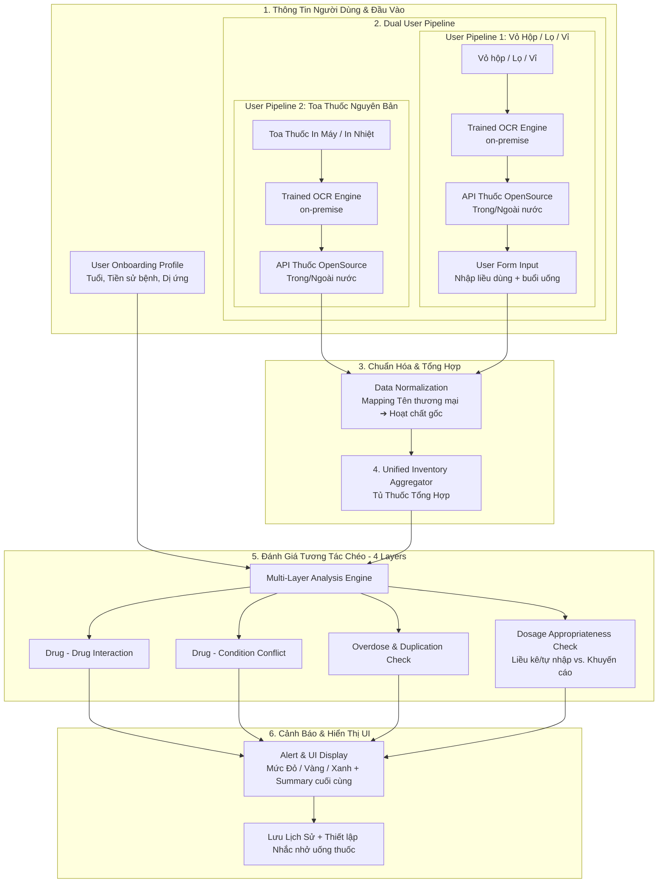

# Mediscan AI 🩺

### Trợ Lý Cảnh Báo Tương Tác & An Toàn Thuốc


---

## 1. Bối Cảnh & Mục Tiêu Dự Án (Project Context)

### 📌 Vấn Đề Thực Tế (Pain-point)
Trong thực tế khám chữa bệnh và sử dụng thuốc tại Việt Nam, người bệnh thường gặp các vấn đề lớn về an toàn sử dụng thuốc:
* **Đơn thuốc chồng chéo:** Bệnh nhân thường xuyên đi khám tại nhiều bệnh viện, phòng khám khác nhau và nhận nhiều đơn thuốc riêng biệt mà các bác sĩ điều trị không hề biết thông tin của nhau.
* **Tự ý mua thuốc:** Việc tự mua thuốc không kê đơn dựa trên vỏ hộp cũ hoặc nghe tư vấn sơ sài tại các hiệu thuốc nhỏ lẻ rất phổ biến.
* **Nguy cơ tiềm ẩn:** Người bệnh không có khả năng tự nhận biết các nguy cơ tương tác thuốc nguy hiểm, trùng lặp hoạt chất gây quá liều, hoặc xung đột nghiêm trọng với các bệnh lý nền sẵn có của bản thân (như cao huyết áp, suy gan, suy thận).

### 🎯 Mục Tiêu Sản Phẩm
**Mediscan AI** ra đời như một giải pháp tham khảo và cảnh báo sớm giúp tối ưu hóa an toàn sử dụng thuốc cho người dùng bằng cách ứng dụng công nghệ trí tuệ nhân tạo (AI):
* **Web Desktop Application (Next.js 14+):** Nền tảng chính ở giai đoạn đầu, được tối ưu cho trải nghiệm upload tài liệu, quản lý tủ thuốc cá nhân và xem báo cáo tương tác trực quan.
* **Mobile App (Flutter / React Native):** Định hướng mở rộng ở giai đoạn tiếp theo, sử dụng chung Central Backend để người dùng có thể quét nhanh vỏ hộp thuốc và nhận cảnh báo tức thời ngay tại quầy thuốc.

---

## 2. Tính Năng Cốt Lõi (Core Features)

### 🔍 1. Dual User Pipeline — On-Premise Trained OCR Engine (Zero External VLM)
Hệ thống xử lý thông tin thuốc đa định dạng thông qua **model OCR tự huấn luyện, chạy on-premise** (không phụ thuộc VLM thương mại bên thứ ba như Gemini/GPT-4o), kết hợp truy vấn API thuốc OpenSource để hoàn thiện thông tin sản phẩm:

* **User Pipeline 2 — Toa thuốc (In máy / In nhiệt):** Model OCR chuyên biệt cho hóa đơn/toa thuốc đọc và trích xuất các trường: *Tên thuốc*, *Hàm lượng*, *Số lượng*, và *Hướng dẫn liều dùng*. Sau đó hệ thống gọi **API thuốc OpenSource (trong/ngoài nước)** để lấy đầy đủ thông tin sản phẩm và liều khuyến cáo chuẩn.
* **User Pipeline 1 — Vỏ hộp / Lọ / Vỉ thuốc:** Model OCR chuyên biệt cho nhãn vỏ hộp trích xuất *Tên thuốc* + *Hàm lượng*. Hệ thống gọi **API thuốc OpenSource** để tra cứu thông tin sản phẩm, đồng thời kích hoạt Form yêu cầu User nhập *Liều dùng* + *buổi uống trong ngày* (chế độ Bán tự động) để đưa ra tư vấn phù hợp hơn.

> Model OCR chuyên biệt cho từng luồng (toa in nhiệt / nhãn vỏ hộp) sẽ được **huấn luyện riêng sau khi hoàn thiện toàn bộ hệ thống**; giai đoạn hiện tại dùng nền tảng PP-OCRv6 ONNX làm baseline on-premise.

### 🔄 2. Smart Fallback & Human-in-the-Loop
Đảm bảo độ chính xác y tế tối đa bằng cách luôn đặt con người làm trung tâm kiểm soát:
* **Confidence Score:** Hệ thống tự đánh giá mức độ tin cậy của kết quả AI trích xuất.
* **Cảnh báo vùng nghi ngờ:** Đánh dấu màu nổi bật những vùng văn bản/thông số mà AI chưa chắc chắn để người dùng chú ý.
* **Auto-complete Từ Điển Thuốc:** Tích hợp từ điển Thuốc Việt Nam để hỗ trợ người dùng tự xác nhận hoặc chỉnh sửa tay nhanh chóng thông qua gợi ý điền tự động thông minh.

### 🗂️ 3. Centralized Active Medication Inventory (Tủ Thuốc Tổng Hợp)
Tất cả các nguồn dữ liệu thuốc đầu vào sẽ được tổng hợp lại một nơi duy nhất:
* Gom gộp đồng thời thông tin từ **Toa thuốc 1** + **Toa thuốc 2** + **Vỏ hộp chụp thêm** + **Thuốc nhập thủ công bằng tay**.
* Tạo thành một danh mục thuốc đang sử dụng (Active Medication List) tập trung để làm cơ sở đánh giá tương tác toàn diện.

### ⚡ 4. Cross-Evaluation Engine (Đánh Giá Tương Tác Chéo)
Bộ máy phân tích đa lớp dựa trên dữ liệu tủ thuốc tổng hợp và hồ sơ người dùng:
* **Trùng lặp hoạt chất / Quá liều:** Phát hiện việc sử dụng đồng thời các biệt dược khác nhau nhưng chứa chung hoạt chất (Ví dụ: Uống cùng lúc *Efferalgan* và *Panadol* dẫn đến quá liều *Paracetamol* gây độc cho gan).
* **Tương tác Thuốc - Thuốc:** Cảnh báo các phản ứng bất lợi khi dùng chung các nhóm thuốc kỵ nhau (Ví dụ: Kháng sinh nhóm *Quinolone* tương tác với các viên bổ sung *Canxi/Sắt* làm giảm hấp thu kháng sinh).
* **Xung đột Thuốc - Bệnh lý:** Cảnh báo nguy hiểm khi thuốc xung đột trực tiếp với bệnh nền của bệnh nhân trong hồ sơ cá nhân (Ví dụ: Thuốc cảm chứa chất co mạch *Pseudoephedrine* chống chỉ định đối với người bệnh *Cao huyết áp*).
* **Đối chiếu Liều Dùng (Layer 4):** Với toa thuốc, kiểm tra liều bác sĩ kê đã phù hợp với tuổi/bệnh nền của User chưa; với vỏ hộp, đối chiếu liều + buổi uống User tự nhập với liều khuyến cáo chuẩn. Kết quả toàn bộ 4 lớp được tổng hợp thành **bản Summary và lời khuyên cuối cùng** ở đầu báo cáo.

### 🗓️ 5. Quản Lý Lịch Sử & Nhắc Nhở Uống Thuốc (History & Reminders)
* **Lịch sử quét thuốc:** Mỗi lần quét/đánh giá (toa thuốc hoặc vỏ hộp) được lưu lại theo dòng thời gian, kèm mức cảnh báo cao nhất đã phát hiện, giúp User và người thân theo dõi lại quá trình sử dụng thuốc.
* **Nhắc nhở uống thuốc:** Cho phép User thiết lập lịch nhắc theo từng buổi (Sáng/Trưa/Chiều/Tối) cho từng thuốc đang có trong Tủ thuốc, bật/tắt độc lập theo nhu cầu.

---

## 3. Kiến Trúc Luồng Xử Lý Dữ Liệu (Detailed Pipeline)

Dưới đây là luồng xử lý dữ liệu chi tiết từ khi người dùng nhập thông tin cho đến khi hệ thống đưa ra cảnh báo:



---

## 4. Kiến Trúc Hệ Thống & Tech Stack

Mediscan AI được xây dựng theo kiến trúc decoupled, giao tiếp thông qua hệ thống RESTful API tập trung (Centralized Backend Architecture):

* **Frontend (Web Desktop First):**
  * **Framework:** Next.js 14+ (App Router) & TypeScript.
  * **Styling & UI:** TailwindCSS kết hợp thư viện thành phần Shadcn UI cho giao diện tinh tế, hiện đại.
* **Backend (Central REST API):**
  * **Framework:** Python FastAPI, tận dụng tối đa cơ chế Asynchronous (async/await) hiệu năng cao.
  * **Validation & Models:** Pydantic để định nghĩa và validate chặt chẽ schema dữ liệu đầu vào/đầu ra.
  * **Image Preprocessing:** Pillow / OpenCV để xử lý ảnh, crop, CLAHE tăng tương phản và chuẩn bị dữ liệu trước khi chạy OCR.
  * **OCR Inference Engine (On-Premise, Zero External VLM):** Model OCR tự huấn luyện chạy trên ONNX Runtime (baseline: PP-OCRv6), tách 2 handler chuyên biệt cho Toa thuốc/Hóa đơn in nhiệt (User Pipeline 2) và Vỏ hộp/Nhãn thuốc (User Pipeline 1). Không gọi API ảnh thương mại bên ngoài (Gemini Vision/GPT-4o Vision).
  * **Clinical Reasoning:** Local LLM qua Ollama (`phi3:mini`, `qwen2.5:0.5b`) hỗ trợ suy luận lâm sàng, có fallback OpenAI API nếu cần.
* **Data & Matching Layer:**
  * Thuật toán so khớp mờ (Fuzzy Matching — RapidFuzz) kết hợp tìm kiếm cục bộ (Local Drug Search) để mapping tên thương mại sang hoạt chất gốc chuẩn xác.
  * Truy vấn **API Thuốc OpenSource trong/ngoài nước** (OpenFDA + CSDL thuốc Việt Nam nội bộ) để lấy đầy đủ thông tin sản phẩm sau khi OCR ra tên thuốc.

---

## 5. Cấu Trúc Thư Mục Dự Án (Project Folder Structure)

Dự án được tổ chức theo cấu trúc monorepo phân tách rõ ràng giữa Frontend và Backend:

```text
mediscan-ai/
├── backend/            # Python FastAPI Backend
│   ├── app/
│   │   ├── api/        # Cổng giao tiếp API Routes (Endpoints)
│   │   ├── config.py   # Quản lý cấu hình & biến môi trường
│   │   ├── schemas/    # Định nghĩa Pydantic Schemas (bao gồm DosageCheck, History, Reminder)
│   │   ├── services/   # OCR Engine on-premise, Normalization, Evaluation (4-Layer), Clinical LLM
│   │   └── main.py     # Điểm khởi chạy ứng dụng FastAPI
│   ├── .env.example    # File môi trường mẫu (chứa các key config)
│   └── requirement.txt # Các thư viện Python phụ thuộc
├── frontend/           # Next.js Web Desktop Application
│   ├── app/            # Next.js App Router (Pages, Layouts)
│   ├── components/     # UI Components dùng chung (Shadcn)
│   ├── lib/            # Utilities, API Fetcher
│   └── package.json    # Quản lý dependencies frontend
├── Dockerfile.backend  # Multi-stage build cho FastAPI
├── Dockerfile.frontend # Multi-stage build cho Next.js (Standalone)
├── docker-compose.yml  # Orchestration Backend + Frontend (1-lệnh deploy)
└── .dockerignore       # Loại trừ secrets & build artifacts khỏi image
```

---

## 6. Hướng Dẫn Cài Đặt Nhanh (Quick Start)

### Cấu Hình Biến Môi Trường (Backend `.env`)
Tạo file `.env` tại thư mục `backend/` dựa trên `backend/.env.example` và thiết lập các biến sau:
```bash
# Không được hardcode API Key trực tiếp vào mã nguồn
OPENAI_API_KEY=your_openai_api_key_here

# Local LLM (for Clinical Assessment) - Ollama hoặc tương tự
LOCAL_LLM_BASE_URL=http://localhost:11434
LOCAL_LLM_MODEL=qwen2.5:0.5b

# OpenFDA Drug Database API
OPENFDA_API_KEY=
OPENFDA_BASE_URL=https://api.fda.gov/drug
```

### Chạy Backend (FastAPI)
1. Di chuyển vào thư mục `backend`:
   ```bash
   cd backend
   ```
2. Khởi tạo môi trường ảo Python và cài đặt dependencies:
   ```bash
   python -m venv .venv
   # Trên Windows:
   .\.venv\Scripts\activate
   # Trên macOS/Linux:
   source .venv/bin/activate
   
   pip install -r requirements.txt
   ```
3. Chạy Server ở chế độ Development:
   ```bash
   uvicorn app.main:app --reload
   ```

### Chạy Frontend (Next.js)
1. Di chuyển vào thư mục `frontend`:
   ```bash
   cd frontend
   ```
2. Cài đặt các gói phụ thuộc:
   ```bash
   npm install
   ```
3. Chạy ứng dụng Next.js tại môi trường Local:
   ```bash
   npm run dev
   ```
4. Truy cập giao diện tại địa chỉ: `http://localhost:3000`

### 🐳 Chạy Toàn Bộ Hệ Thống Bằng Docker (1-Step Production)

Dự án được đóng gói sẵn sàng triển khai Production bằng Docker Compose — chỉ cần **1 lệnh** để khởi chạy đồng thời cả Frontend (Next.js) và Backend (FastAPI):

```bash
# 1. Tạo file backend/.env dựa trên backend/.env.example (nếu chưa có)
cp backend/.env.example backend/.env

# 2. Build image & khởi chạy toàn bộ hệ thống
docker compose up --build
```

Sau khi khởi động thành công:
- 🌐 **Frontend (Web UI):** http://localhost:3000
- ⚙️ **Backend (REST API):** http://localhost:8000 (Swagger Docs: http://localhost:8000/docs)

Cấu hình API Keys / services dự phòng cho LLM thông qua biến môi trường của host hoặc file `backend/.env`:
```bash
# Trên Windows (PowerShell):
$env:OPENAI_API_KEY="your_openai_api_key_here"
$env:LOCAL_LLM_BASE_URL="http://localhost:11434"
$env:LOCAL_LLM_MODEL="qwen2.5:0.5b"
docker compose up --build
```

Các lệnh hữu ích:
```bash
docker compose ps                    # Kiểm tra trạng thái containers
docker compose logs -f backend       # Xem log Backend
docker compose logs -f frontend      # Xem log Frontend
docker compose down                  # Tắt toàn bộ hệ thống
```

> [!NOTE]
> - Cấu trúc Docker: `Dockerfile.backend` (multi-stage, non-root user, Uvicorn), `Dockerfile.frontend` (Next.js Standalone mode), `docker-compose.yml` (network bridge kết nối 2 services).
> - **An toàn:** Các API Keys được truyền qua biến môi trường, **KHÔNG BAO GIỜ** commit file `.env` hoặc nhúng key vào mã nguồn (xem `.dockerignore`).

---

## 7. Giới Hạn Sử Dụng & Miễn Trừ Trách Nhiệm (Disclaimer)
> [!IMPORTANT]
> **Mediscan AI** chỉ đóng vai trò là một công cụ tham khảo hỗ trợ cảnh báo sớm các nguy cơ tương tác và an toàn thuốc. Hệ thống **KHÔNG** thay thế cho các chẩn đoán, lời khuyên chuyên môn hoặc chỉ định từ bác sĩ chuyên khoa và dược sĩ có chuyên môn. Người bệnh tuyệt đối không tự ý thay đổi liều lượng hoặc ngừng thuốc mà không có sự tham vấn của nhân viên y tế.
